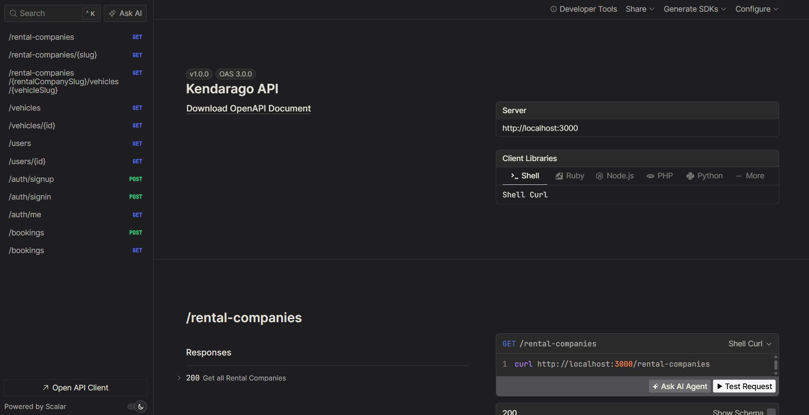
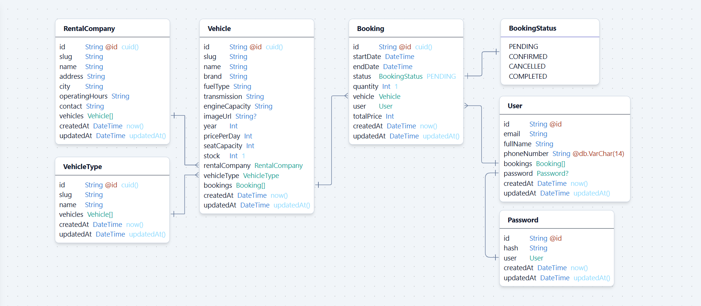

# Kendarago Backend API

A RESTful API for Kendarago, a web-based application designed to facilitate vehicle rentals. Built with Bun, Hono, Prisma, and PostgreSQL.



## ERD Diagram



## REST API Specification

- Local: <http://localhost:3000>
- Production: <https://api.kendarago.com>
  - Render: <https://kendarago-api.onrender.com>

`rental-companies` :

| Endpoint                       | HTTP  | Description                                 | Done |
| ------------------------------ | ----- | ------------------------------------------- | ---- |
| `/`                            | `GET` | Get all rental companies                    | ✅   |
| `/:slug`                       | `GET` | Get rental company by Slug and its vehicles | ✅   |
| `/:slug/vehicles/:vehicleSlug` | `GET` | Get vehicle by Slug within a rental company | ✅   |

`vehicles` :

| Endpoint | HTTP  | Description       | Done |
| -------- | ----- | ----------------- | ---- |
| `/`      | `GET` | Get all vehicles  | ✅   |
| `/:id`   | `GET` | Get vehicle by ID | ✅   |

`Auth`:

| Endpoint         | HTTP   | Permission    | Description       | Done |
| ---------------- | ------ | ------------- | ----------------- | ---- |
| `/users`         | `GET`  | Public        | Get all users     | ✅   |
| `/users/:id`     | `GET`  | Public        | Get user by ID    | ✅   |
| `/auth/register` | `POST` | Public        | Register user     | ✅   |
| `/auth/login`    | `POST` | Public        | Login user        | ✅   |
| `/auth/me`       | `GET`  | Authenticated | Get current user  | ✅   |
| `/bookings`      | `GET`  | Authenticated | Get user bookings | ✅   |
| `/bookings`      | `POST` | Authenticated | Create booking    | ✅   |

## Getting Started

Copy and edit `.env` file:

```sh
cp .env.example .env
```

Setup database:

```sh
# Run database only
bun db:up
```

Install dependencies:

```sh
bun install
```

Migrate database and generate Prisma Client:

```sh
bun db:migrate
# prisma migrate dev && prisma generate
```

Seed initial products:

```sh
bun db:seed
# prisma db seed
```

Run development server:

```sh
bun dev
# bun run --hot src/index.ts
```

Open <http://localhost:3000>.

## Production

Make sure the `DATABASE_URL` is configured in `.env` file for usage with Docker Compose.

Build the Docker image:

```sh
bun docker:build
# docker compose up -d --build
```

If only run the Docker container:

Migrate database and generate Prisma Client:

```sh
bun db:migrate
# prisma migrate dev && prisma generate
```

Seed initial products:

```sh
bun db:seed
# prisma db seed
```

Run development server:

```sh
bun dev
# bun run --hot src/index.ts
```

Open <http://localhost:3000>.
